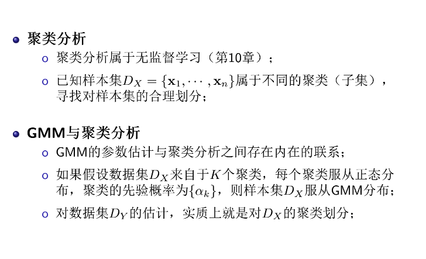
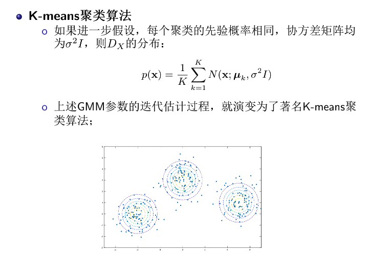
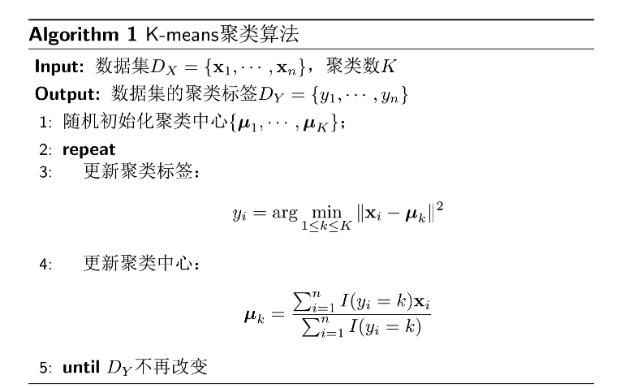
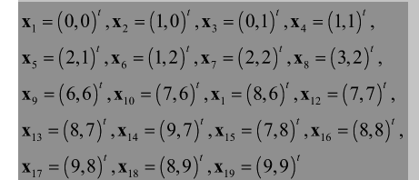
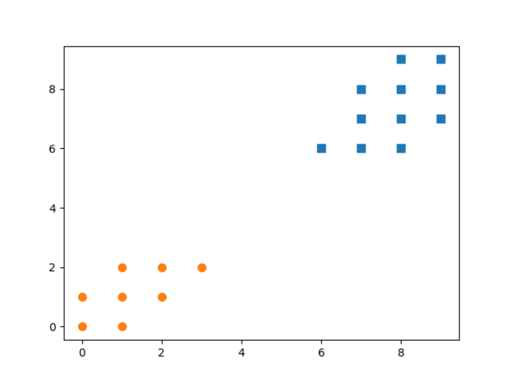
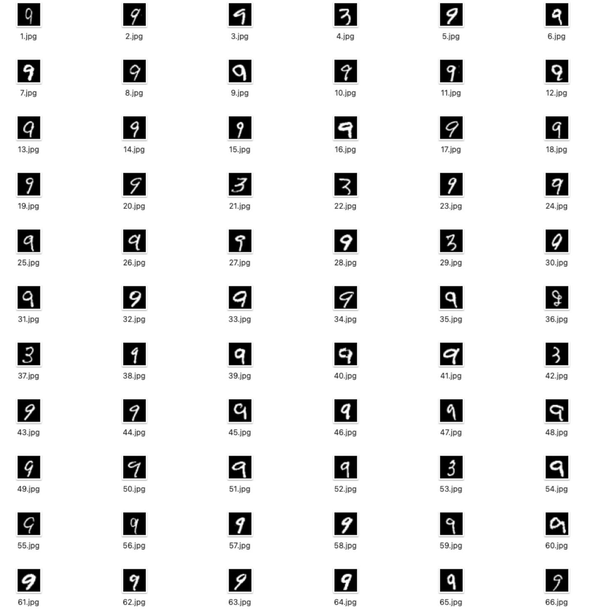
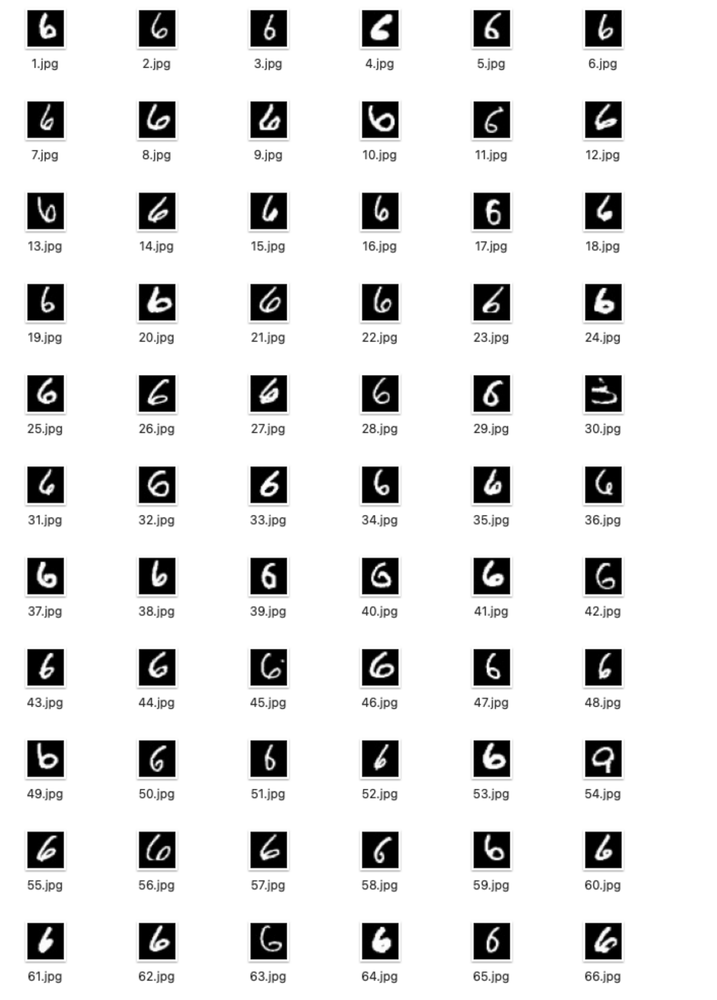
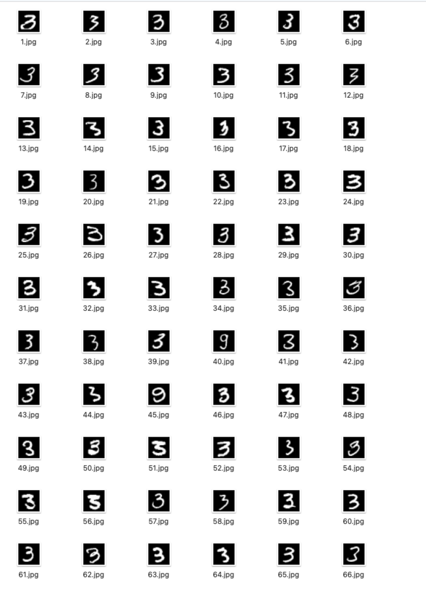

基于EM算法推导K-means算法

K-means算法是EM算法的特例，它的算法流程及其与GMM,EM的关系如下

推导过程如下

本质上来说，就是将数据分布假设为正态分布，再用EM算法估计每个正态分布的均值

kmeans1.py 文件实现对
19个样本进行聚类，聚为两个簇

聚类结果展示：

kmeans2.py 文件实现对Mnist手写体3，6，9三类别数字进行聚类，
原数据存储于Sample.csv中
聚类结果分别存储于index1，index2，index3中

index1：

index2：

index3：
